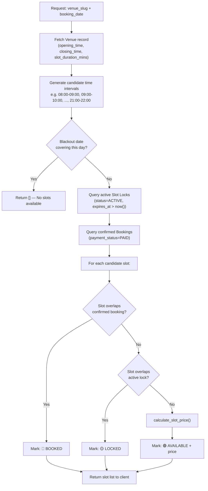
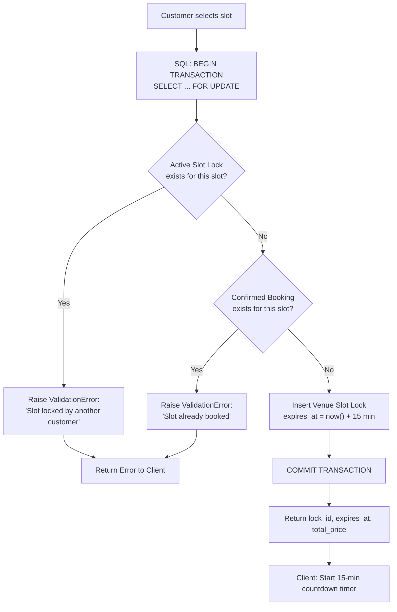
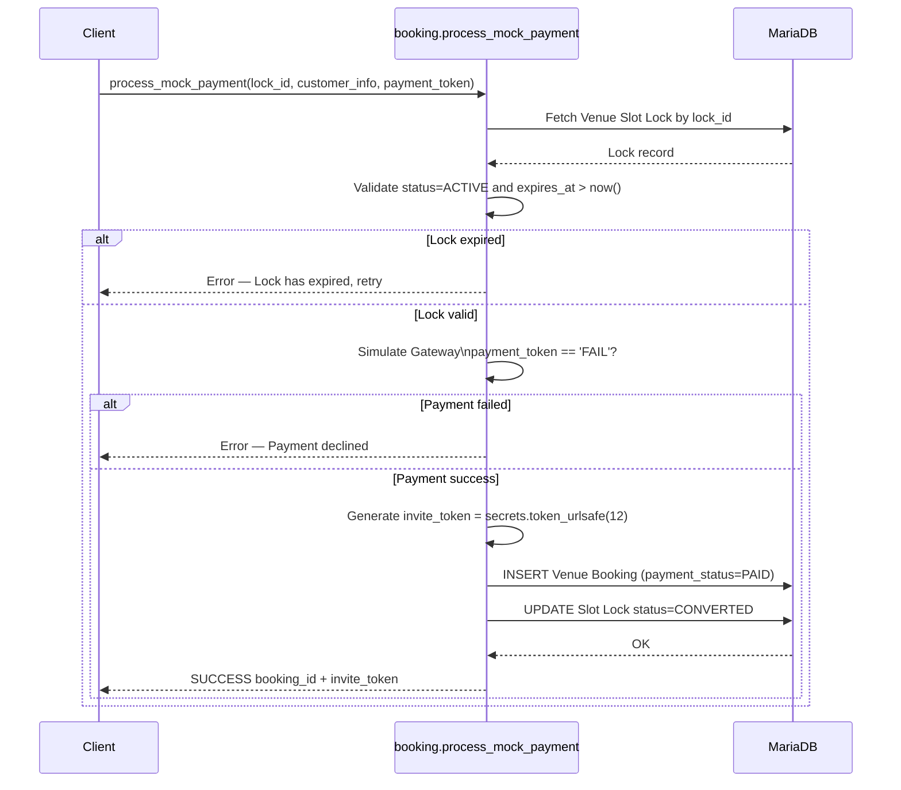

# 02. API & Business Logic Specification

## Overview
This specification details the server-side Python methods exposed via `@frappe.whitelist()` for slot management, pricing evaluation, locking, and checkout.

---

## 1. Whitelisted APIs

### `avenza_bookings.api.venue.get_venue_details(venue_slug)`
* **Access**: Public (`allow_guest=True`)
* **Description**: Returns detailed venue info, opening/closing schedule, base rate, cover image, rules, and active dynamic pricing rules.

### `avenza_bookings.api.venue.get_available_slots(venue_slug, booking_date)`
* **Access**: Public (`allow_guest=True`)
* **Business Logic**:
  1. Fetch `Venue` by `venue_slug`. Check `opening_time`, `closing_time`, and `slot_duration_mins`.
  2. Generate candidate slot intervals (e.g. `[08:00 - 09:00, 09:00 - 10:00, ..., 21:00 - 22:00]`).
  3. Check `Venue Blackout Date` records for `booking_date`. If date falls in full blackout, return empty slots.
  4. Query active `Venue Slot Lock` records (`status='ACTIVE'`, `expires_at > now()`) and `Venue Booking` records (`payment_status='PAID'`) for `venue` on `booking_date`.
  5. Mark candidate slots as `available=True`, `locked=True`, or `booked=True`.
  6. For available slots, calculate the dynamic price using `calculate_slot_price()`.

### `avenza_bookings.api.venue.calculate_slot_price(venue, booking_date, start_time, end_time)`
* **Access**: Public (`allow_guest=True`)
* **Business Logic**:
  - Start with `venue.base_price_per_slot`.
  - Evaluate `Venue Pricing Rule` child records attached to the venue:
    - **Day of Week**: Check if `booking_date` day (e.g., Saturday) matches `days_of_week`.
    - **Peak Hours**: Check if `start_time` and `end_time` overlap with rule `start_time` and `end_time`.
    - **Date Range**: Check if `booking_date` falls within `start_date` and `end_date`.
  - Calculate adjustment:
    - `Percentage Increase`: `price += base_price * (value / 100)`
    - `Fixed Amount Add`: `price += value`
    - `Override Flat Price`: `price = value`
  - Return `{ "base_price": base, "adjustments": adj, "total_price": price, "applied_rules": rules }`.

### `avenza_bookings.api.booking.lock_slot(venue, booking_date, start_time, end_time, session_token)`
* **Access**: Public (`allow_guest=True`)
* **Concurrency Protection**:
  - Acquire database lock using SQL `FOR UPDATE` on `Venue Slot Lock` & `Venue Booking`.
  - Verify slot is NOT already booked or active-locked by another session.
  - If locked, raise `frappe.ValidationError("Slot is currently locked by another customer. Please select another slot.")`.
  - Insert `Venue Slot Lock` record with `expires_at = now() + 15 minutes`.
  - Return `{ "lock_id": lock.name, "expires_at": lock.expires_at, "total_price": price }`.

### `avenza_bookings.api.booking.process_mock_payment(lock_id, customer_name, customer_email, customer_phone, notes, payment_token)`
* **Access**: Public (`allow_guest=True`)
* **Business Logic**:
  - Validate `lock_id`: Must exist, `status == 'ACTIVE'`, and `expires_at > now()`.
  - Simulate gateway response (if `payment_token == 'FAIL'`, reject payment).
  - On payment success:
    1. Generate unique random `invite_token` (e.g. `secrets.token_urlsafe(12)`).
    2. Create `Venue Booking` record with `payment_status='PAID'`.
    3. Update `Venue Slot Lock` status to `CONVERTED`.
    4. Return `{ "status": "SUCCESS", "booking_id": booking.name, "invite_token": booking.invite_token }`.

### `avenza_bookings.api.booking.get_booking_invite(invite_token)`
* **Access**: Public (`allow_guest=True`)
* **Description**: Returns booking details (Venue name, address, rules, date, time, customer name) for public guest invitation rendering and RSVP submission.

### `avenza_bookings.api.booking.submit_guest_rsvp(invite_token, guest_name, guest_email, status)`
* **Access**: Public (`allow_guest=True`)
* **Description**: Appends guest RSVP response (`GOING`, `MAYBE`, `DECLINED`) to `Venue Booking`.

---

## 2. Background Tasks & Cron Hooks

### `avenza_bookings.tasks.clear_expired_slot_locks`
* **Cron Schedule**: Every 5 minutes (`hooks.py` `scheduler_events.cron: "*/5 * * * *"`)
* **Logic**: Updates all `Venue Slot Lock` records where `status = 'ACTIVE'` and `expires_at < now()` to `status = 'EXPIRED'`.
