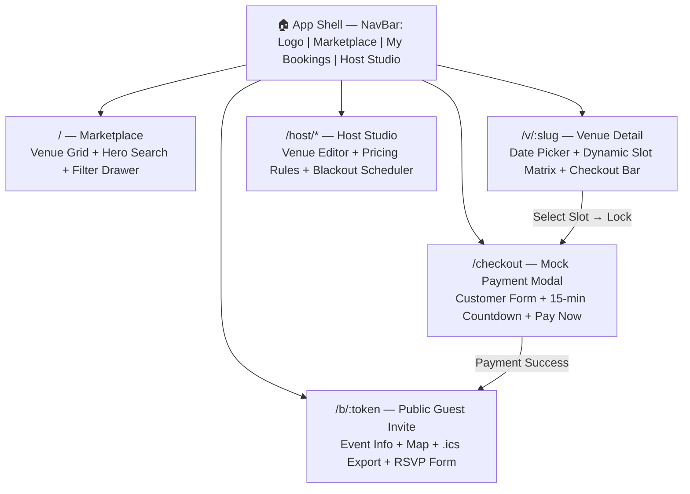
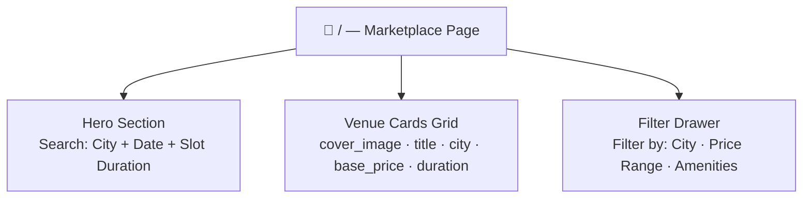
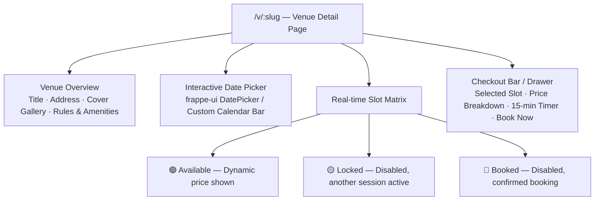
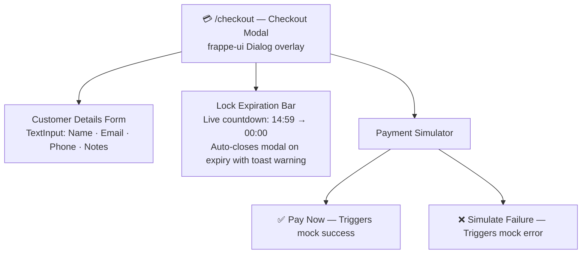
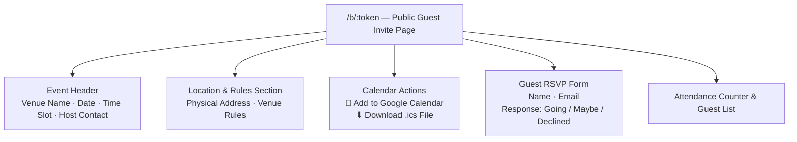
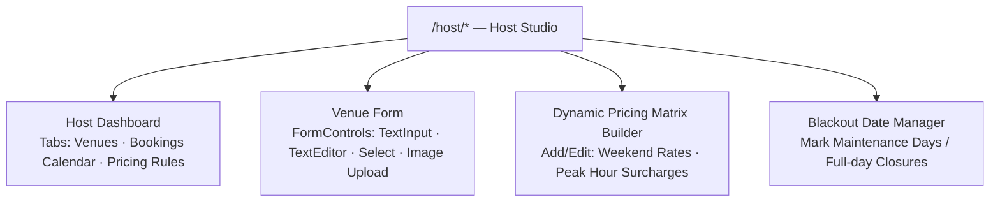

# 03. Frontend Frappe UI Design Specification

## Overview
This specification documents the single-page Vue 3 application built inside `avenza_bookings/frontend` utilizing `frappe-ui` components and Tailwind CSS.

---

## 1. App Shell Architecture

---

## 2. Page & Component Breakdown

### A. Marketplace / Venue Discovery (`/`)

### B. Venue Detail & Slot Booking (`/v/:slug`)

### C. Checkout & Mock Payment Modal

### D. Public Shareable Guest Invite Page (`/b/:token`)

### E. Host Studio (`/host/venues`)

---

## 3. Design System & Frappe UI Guidelines
- **Color Tokens**: `bg-surface-base`, `bg-surface-gray-1`, `text-ink-gray-9`, `text-ink-gray-5`, `border-outline-gray-2`.
- **Button Styling**: Use `<Button variant="solid" theme="blue">` or `variant="outline"`. Never hand-roll `<button class="bg-blue-500">`.
- **Overlay & Alerts**: `frappe-ui` `<Dialog>` with `v-model:open`, imperative `toast.success()` / `toast.error()`.
- **Icon Set**: CSS classes e.g. ``.
